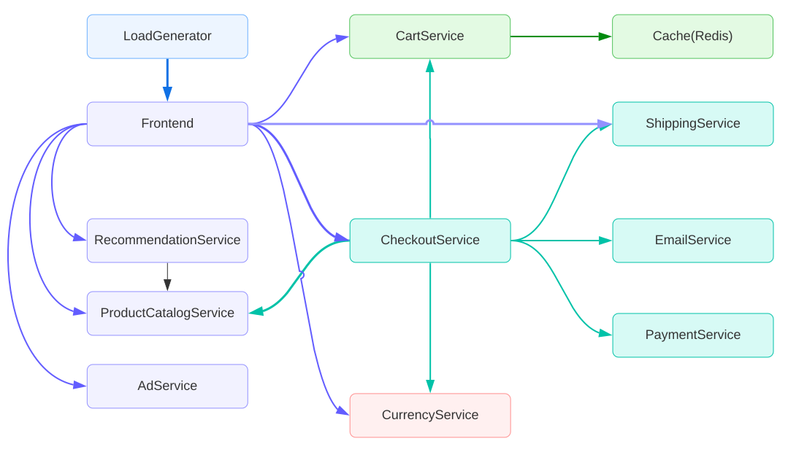
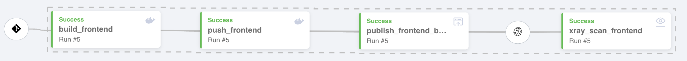

# Online Boutique 

This repository contains the application source and JFrog pipeline artifacts for our swampUP 2022 talk "Accelerating Continuous delivery with DORA, Cloud Deploy and JFrog Pipelines" on May 26th, 2022
See the [Infrastructure Repository](https://github.com/gdg-cloud-montreal/swampup-2022) for application deployment information

## Talk abstract

In  session, we will tell a story of an imaginary company that wants to deliver high-quality software faster to their customers, yet something is holding it back. Our imaginary company learned about DORA assessments and discovered they are a medium-level performer among similar companies in the industry. They needed to improve several things, including automating their CI and CD processes, to go to the next level.

Are you interested in learning how to use the DevOps Research and Assessment program (DORA) and new Cloud Native Solutions for CI/CD? Join our session and learn how to use the DORA program and see a demo of how managed CI/CD solutions like Google Cloud Deploy, JFrog Pipelines, and Artifactory help you implement modern microservices deployments on K8s and serverless platforms!

### Architecture

**Online Boutique** is a cloud-native microservices demo application,composed of 11 microservices written in different languages that talk to each other over gRPc.
Online Boutique consists of a 10-tier microservices application. The application is a web-based e-commerce app where users can browse items, add them to the cart, and purchase them.

| Service                                          | Language      | Description                                                                                                                   |
| ------------------------------------------------ | --------------| ----------------------------------------------------------------------------------------------------------------------------- |
| [frontend](./frontend)                           | Go            | Exposes an HTTP server to serve the website. Does not require signup/login and generates session IDs for all users automatically. |
| [cartservice](./cartservice)                     | C#            | Stores the items in the user's shopping cart in Redis and retrieves it.                                                           |
| [productcatalogservice](./productcatalogservice) | Go            | Provides the list of products from a JSON file and ability to search products and get individual products.                        |
| [currencyservice](./currencyservice)             | Node.js       | Converts one money amount to another currency. Uses real values fetched from European Central Bank. It's the highest QPS service. |
| [paymentservice](./paymentservice)               | Node.js       | Charges the given credit card info (mock) with the given amount and returns a transaction ID.                                     |
| [shippingservice](./shippingservice)             | Go            | Gives shipping cost estimates based on the shopping cart. Ships items to the given address (mock)                                 |
| [emailservice](./emailservice)                   | Python        | Sends users an order confirmation email (mock).                                                                                   |
| [checkoutservice](./checkoutservice)             | Go            | Retrieves user cart, prepares order and orchestrates the payment, shipping and the email notification.                            |
| [recommendationservice](./recommendationservice) | Python        | Recommends other products based on what's given in the cart.                                                                      |
| [adservice](./adservice)                         | Java          | Provides text ads based on given context words.                                                                                   |
| [loadgenerator](./loadgenerator)                 | Python/Locust | Continuously sends requests imitating realistic user shopping flows to the frontend.                                              |

## Building the Online Boutique

Each of the microservices in this repository has an associated JFrog Pipeline configuration to build, and publish a new container image. Additionally each container image is scanned with JFrog Xray as part of the build pipeline

This repository is based on the work found in [Google Cloud Platform Microservices demo repository](https://github.com/GoogleCloudPlatform/microservices-demo) 